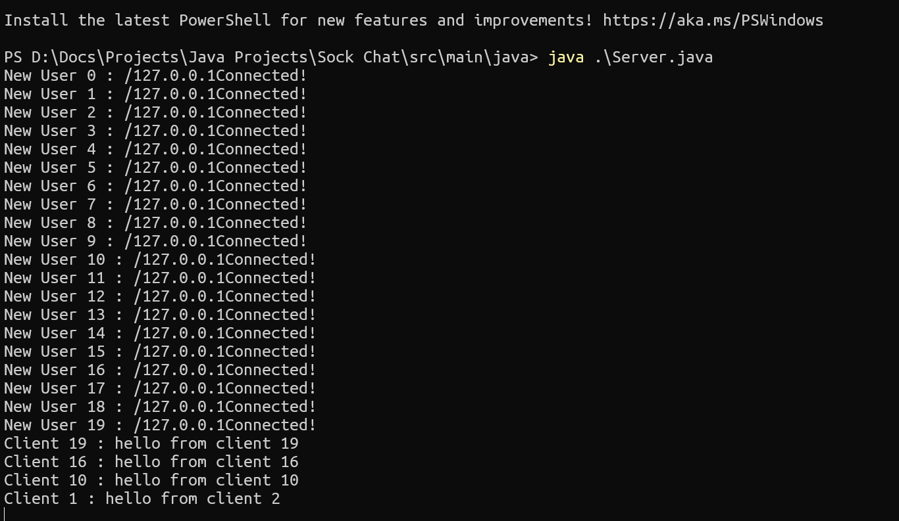

# Sock Chat
## Description

Simple Hobby project which creates a group chat application with sockets

## HOW TO USE
1. Start the server file [Server.java]
2. Start client [Client.java] (can spin up multiple instances 😉)

### Images

